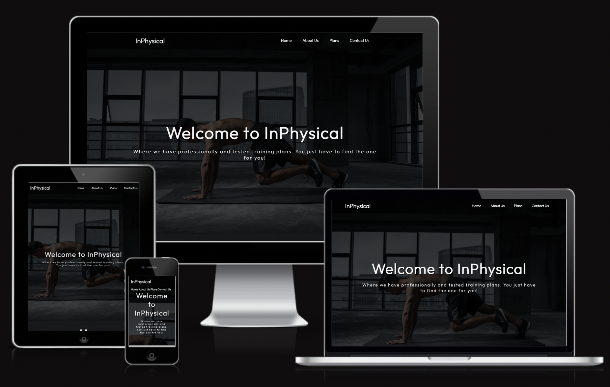

# **InPhysical Responsive Website Project**

## **Milestone Project 1 for Code Institute Full Stack Software Development.**
### Author - Daniel Cave

The InPysical website is a website created to provide free workout plans for the public. All plans are created by a fully qualified personal trainer and will be updated monthly with new plans. The website offers three different workout plans that can be followed by any experienced fitness fanatic! Users of the website will be able to view all the free and tested plans along with video previews and information on each exercise to allow the user to follow.

The site will have a Home page, about us and what we offer section. Along with a page for each workout plan. Lastly will have a contact page that users can use to contact us with any questions or requests for the website or workout plans.

Live version of the site avalible - <a href="https://danieljcave.github.io/inphysical-website/" target="_blank">Click Here!</a>

## Table Of Contents
* [**User Experience**](#user-experience)
    * [**Target Audience**](#target-audience)
    * [**Website Goals**](#website-goals)
    * [**User Stories**](#user-stories)
        * [**New User Visitor Goals**](#new-user-visitor-goals)
        * [**Returning Visitor Goals**](#returning-visitor-goals)
* [**Design**](#design)
    * [**Color Scheme**](#color-scheme)
    * [**Imagery**](#imagery)
    * [**Typography**](#typography)
* [**Website Features**](#website-features)
* [**Technologies Used**](#technologies-used)
    * [**Programming Languages**](#programming-languages)
    * [**Programs & Libraries Used**](#programs--libraries-used)
* [**Testing**](#testing)
    * [**W3C Markup Validator**](#w3c-markup-validator)
    * [**W3C CSS Validator**](#w3c-css-validator)
    * [**Lighthouse Testing**](#lighthouse-testing)
    * [**Browser Testing**](#browser-testing)
* [**Bugs**](#bugs)
* [**Deployment**](#deployment)
    * [**Github Pages**](#github-pages)
    * [**Making a Local Clone**](#making-a-local-clone)
    * [**Forking the Repository**](#forking-the-repository)
* [**Credits**](#credits)
    * [**Website Content**](#website-content)
    * [**Media**](#media)
    * [**Special Acknowledgements**](#special-acknowledgements)

## **User Experience**
### **Target Audience**
The target audience of the website is to have all fitness users of all experiences. From new beginners to experienced fitness users. The site is to help users to find and use free and tested fitness plans all created by a qualified trainer. For all ages and body types. Finally, users that have created their plans or are looking for inspiration or exercises to help their plans and be able to use the contact forms to ask questions.

### **Website Goals**
The primary goal of the website is to provide free workout plans that are tried and tested by a qualified personal trainer. Another goal of the website is to be a central location for free plans that are all available for users to try and test themselves to find the one most suited for them. Lastly to have a location where users of all experience can ask questions or help with our contact form and receive that help.

## **User Stories**
- ## New User Visitor Goals
    1. The website is designed to allow new users to navigate to available plans with ease.
    2. To provide a central location to view and try each available plan the website offers.
    3. Have information and exercise video tutorials for new users to follow.

- ### Returning Visitor Goals
    1. To have different workout plans that can be tried and tested.
    2. Have a way of contacting someone with questions about the plan or general enquiries.
    3. To have social media links to follow or use to reach out to others.

- ## Design
    - ### Color Scheme
        - In the website design I had choose to use 2 colors. First being #f5f5f5 (Off-White) and 17181A (Dark Grey). When first thinking of how the website should look, the primary goal was a clean and simplistic-looking site. Users can know exactly what the website is about at first glance and easy to navigate. The website also used a gradient colour over the main hero image. The gradient adds a black gradient with 0.75 or 75% transparency on the image. This was used to darken the image to allow text to be viewed. 
    - ### Imagery
        - The website consists of 4 different images that are used in the website. Firstly and the main picture is a man doing a plank exercise in a large open room. This and all the images were found on [Pexals](https://www.pexels.com/) which is a free image library. The other images used were for the workout plan preview links, each where selected for the design of each plan and the majority of muscle groups that would be used. To add a visual representation to the user to entice them into the plan.
    - ### Typography
        - When selecting the font to choose, the same goals were alongside the colour scheme. To find a clean and simplistic font that gives the website the look of professional and friendly. The font that was chosen was "Outfit" a free available font found on [Google Fonts](https://fonts.google.com/)

- ## Wireframes
    - Home Page Wireframe - [View](/assets/readME/website-plan-frame.png)

    - Workout Plan Page Wireframe - [View](/assets/readME/workout-plan-frame.png)
    
    - Contact us Page Wireframe - [View](/assets/readME/contact-form-frame.png)

## **Website Features**
**All Features have been separated into their own feature read-me file. To access [Click here](FEATURES.md)**

## **Technologies Used**

### Programming Languages
- [HTML5](https://en.wikipedia.org/wiki/HTML5)
- [CSS3](https://en.wikipedia.org/wiki/CSS)

### Programs & Libraries Used
1. [Visual Studio Code (VSCode)](https://code.visualstudio.com/)
    - Primary programming editor for creating and editing the website.
2. [Gitpod](https://www.gitpod.io/)
    - Gitpod is an IDE used firstly to create the page but then moved to VSCode.
3. [Adobe Free Online Editor](https://www.adobe.com/express/feature/image/editor)
    - Adobe free online editor was used to edit photos used on the website.
4. [Pexals](https://www.pexels.com/)
    - Used to locate and use free images for the website.
5. [Google Fonts](https://fonts.google.com/)
    - Google Fonts was used to import the "Outfitt" Font to the style.css and to be used on the website.
6. [Google Docs](https://docs.google.com)
    - Primarily used for Pre note planning and for making notes and planning.
7. [Figma](https://www.figma.com/)
    - Figma was used to create plans and wireframes for the website.
8. [Font Awesome](https://fontawesome.com/)
    - Font Awesome provides free icons that were used on the website pages.
9. [Git](https://git-scm.com/)
    - Git is used to commit changes to website code and then push them to the Github repository.
10. [Github](https://github.com/)
    - Github was used to store the website code when created on VSCode and pushed with Git.
    - The website is also hosted via GitHub pages.
11. [VSCode Prettier](https://marketplace.visualstudio.com/items?itemName=esbenp.prettier-vscode)
    - Prettier Formater was used in vs code to beautify and format the code for best practices.

## **Testing**
The W3C Markup Validator and W3C CSS Validator Services were used to test each page to make sure there were no syntax errors in the website.
### W3C Markup Validator

Home Page HTML Validation

Push Pull Legs HTML Validation

Full-Body HTML Validation

Upper, Lower HTML Validation

Contact Us HTML Validation

Contact Response HTML Validation

### W3C CSS Validator

Style Sheet CSS Validation

### Lighthouse Testing

Lighthouse Testing

## Further Testing 

### Browser Testing
The website responsiveness was tested in the browsers below.
- Google Chrome
- Safari
- Brave

All testing was successful and no browser compatibility issues.
Friends and family were asked to view and use the website as fresh new users. They were able to offer first-time user comments and additions to the website.

## Bugs
- Had an issue with my hero image being displayed when I pushed the website to the GitHub pages. After Google and looking through the documentation, my mentor was able to help with a milestone meeting update. The issue was down to a location request in the CSS.
- When creating the response media queries, there was an issue with the navigation bar overlapping at smaller screen sizes. The issue was to add a media query for that specific issue and then the navigation adjusted correctly with the screen size difference.
- Final issue was when completing the final html validation. During a lighthouse test, it suggested adding an "alt" tag to the footer icons for accessibility. But when completing the html validator it showed as an error due to the i frame cannot have an alt name. Once removed the pages showed with no errors.

## Deployment
### Github Pages
The project was deployed to git hub pages using the following steps.
1. Log into GitHub and navigate to the project repository [InPhysical Project](https://github.com/danieljcave/inphysical-website)
2. At the top of the repository, find an option for "Settings" on the menu.
3. Scroll down in the settings until an option for the "GitHub Pages" section.
4. Under the source dropdown, select "Deploy from Main Branch"
5. The Page should then refresh automatically.
6. Scroll back down the page and then find the link to the published page [link](https://github.com/danieljcave/inphysical-website) in the GitHub Pages section.

### Making a Local Clone
1. Log into GitHub and navigate to the project repository [InPhysical Project](https://github.com/danieljcave/inphysical-website)
2. Under the repository at the top of the page, select "Clone".
3. There will be 3 options to clone from. HTTPS, SSH or Github CLI. Or Download the repository.
4. Cloning with HTTPS, copy link and open git bash.
5. Then type `git clone` and paste the URL following. It should look like this 
> `git clone https://github.com/danieljcave/inphysical-website`
6. Followed by pressing Enter, the repository will then be cloned locally.
If there are any issues with cloning the repository, GitHub has a detailed guide with extra information if any issues arise. [Click Here](https://docs.github.com/en/repositories/creating-and-managing-repositories/cloning-a-repository)

### Forking the Repository
Forking a repository will make a copy of that repository and edit without making any changes to the original repository to mainly test ideas or changes with the repository.
1. Log into GitHub and navigate to the project repository [InPhysical Project](https://github.com/danieljcave/inphysical-website)
2. Scroll to the top of the repository to top where there is an option called "Fork"
3. This will then allow you to make a copy of the repository in your GitHub account.

## Credits
### Website Content
- All Text content excluding workout plans was written by Author and Developer Daniel Can.
- Each Workout plan was created, designed and tested by Level 3 Qualified Personal Trainer, Ellen Withington.
- Information regarding each plan was consulted with our Qualified Personal Trainer, Ellen Withington. Along with research for each workout plan and information written.
    - [Push Pull Legs Research](https://www.aston.ac.uk/sport/news/tips/fitness-exercise/push-pull-legs#:~:text=In%20the%20%E2%80%9Cpush%E2%80%9D%20workout%20you,%2C%20hamstrings%2C%20calves%20and%20abdominals.) from Aston University.
    - [Full Body](https://www.muscleandstrength.com/workouts/full-body) information found from Muscle & Strength
    - [Upper Lower](https://bmcsportsscimedrehabil.biomedcentral.com/articles/10.1186/s13102-022-00481-7) research conducted by BMC Sports Science

## Media
- [Pexals](https://www.pexels.com/) - Hero image and workout plan preview plan images sourced and obtained from Pexals.
- All Images including Hero image and plan preview images were edited down to size specific for the website by author and developer, Daniel Cave.
    - Hero image was edited down to 1920 Pixels by 1080 Pixels (HD) using [Adobe Free Online Editor](https://www.adobe.com/express/feature/image/editor)
    - All plan preview images were scaled down to 500 pixels by 500 pixels using [Adobe Free Online Editor](https://www.adobe.com/express/feature/image/editor)

## Special Acknowledgements
- My Mentor **Spencer Barriball** for overall feedback and guidance along my project journey to improve the overall website and assist me as a developer.
-  Level 3 Qualified personal trainer **Ellen Withington** for creating each workout plan and testing each plan herself. Along with advice and guidance on workout plan information and context.
